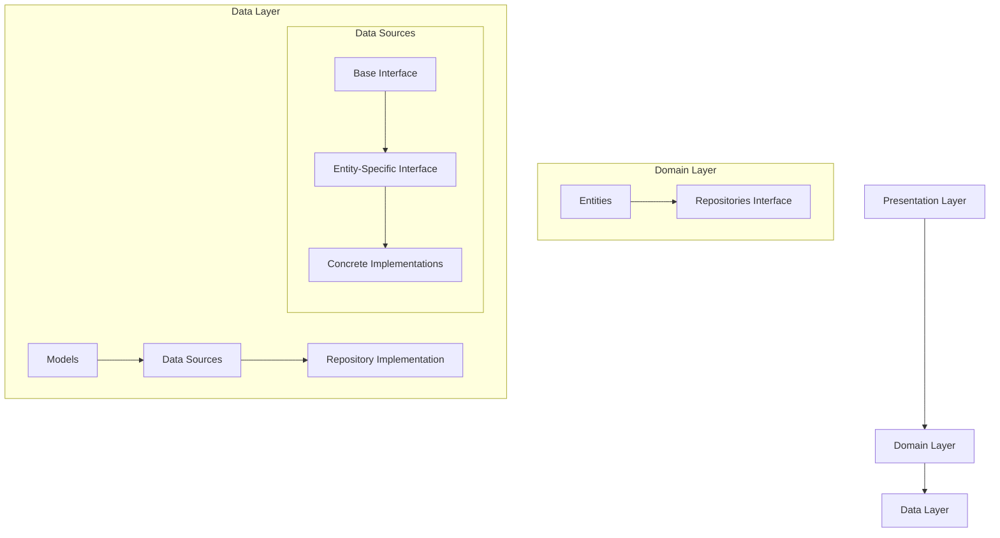
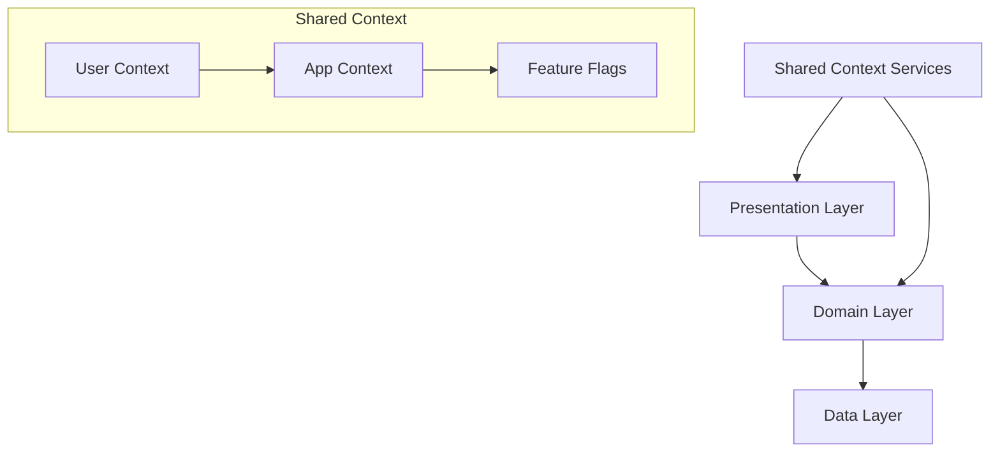

# PayZapp Clean Architecture: Overview and Philosophy
Version 1.0

## Introduction

Modern mobile applications face increasing complexity in managing data flows, user interactions, and business logic. PayZapp's clean architecture approach addresses these challenges by creating clear boundaries between different aspects of the application, enabling teams to work independently and efficiently.

### Why This Architecture?

1. **True Separation of Concerns**
   - UI developers can focus on creating delightful user experiences without worrying about data implementation
   - Data layer experts can optimize storage and sync strategies without affecting business logic
   - Business logic can evolve independently of its data sources or presentation
   - Each layer has a single responsibility and clear boundaries

2. **Independent Development**
   - Teams can work in parallel with minimal coordination overhead
   - UI can be developed against mock data sources
   - Data layer implementations can be swapped without affecting other layers
   - Business logic can be refined without waiting for UI or data layer changes

3. **Testability by Design**
   - Each layer can be tested in isolation
   - Mock implementations are built into the architecture
   - Business logic can be tested without real data sources
   - UI can be tested with predictable data states
   - Clear interfaces make stubbing and mocking natural

4. **Data Complexity Management**
   - Complex data operations (caching, sync, offline support) are contained in the data layer
   - Other layers work with simple, consistent interfaces
   - Data freshness and sync states are handled transparently
   - Different storage and sync strategies can be implemented without affecting consumers

5. **Future-Proof Architecture**
   - New data sources can be added without changing business logic
   - UI frameworks can be updated or replaced more easily
   - Business rules can evolve independently
   - Testing remains reliable during refactoring

## Core Philosophy

Our architectural approach is guided by several key principles:

1. **Clear Separation of Concerns**
   - Each layer has specific responsibilities and knows nothing about layers above it
   - Dependencies flow inward from presentation to data layer
   - Business logic is isolated from data implementation details

2. **Local-First Data Management**
   - Data operations prioritize local responses for immediate user feedback
   - Implementation-specific sync strategies
   - Non-blocking state-based responses

3. **Implementation Flexibility**
   - Dependency injection for swapping implementations
   - Clear interfaces with optional capabilities
   - Support for different data storage and sync strategies

## Architecture Overview



## Directory Structure

```
lib/
├── domain/
│   ├── entities/
│   │   └── payment.dart
│   └── repositories/
│       └── payment_repository.dart
├── data/
│   ├── models/
│   │   └── payment_model.dart
│   ├── datasources/
│   │   ├── interfaces/
│   │   │   ├── data_source.dart
│   │   │   └── payment_ds.dart
│   │   └── implementations/
│   │       ├── payment_firebase_ds.dart
│   │       └── payment_rest_sqlite_ds.dart
│   └── repositories/
│       ├── payment_repository_impl.dart
│       └── payment_repository_impl_premium.dart
└── presentation/
    └── payment/
        ├── payment_screen.dart
        └── payment_view_model.dart
```

## Layer Details

### 1. Domain Layer

The domain layer contains pure business logic and interfaces, independent of any implementation details.

#### Entities
```dart
// domain/entities/payment.dart
class Payment {
  final String id;
  final double amount;
  final PaymentStatus status;
  final DateTime timestamp;

  const Payment({
    required this.id,
    required this.amount,
    required this.status,
    required this.timestamp,
  });
}
```

#### Repository Interfaces
```dart
// domain/repositories/payment_repository.dart
abstract class PaymentRepository {
  Future<Payment?> getPayment(String id);
  Future<void> processPayment(Payment payment);
  Stream<Payment?> watchPayment(String id);
}
```

### 2. Data Layer

The data layer handles all data operations and implements the repository interfaces defined in the domain layer.

#### Models
```dart
// data/models/payment_model.dart
class PaymentModel {
  final String id;
  final double amount;
  final String status;
  final DateTime timestamp;

  // Domain conversion
  Payment toDomain() => Payment(
    id: id,
    amount: amount,
    status: PaymentStatus.fromString(status),
    timestamp: timestamp,
  );

  // JSON serialization
  Map<String, dynamic> toJson() => {
    'id': id,
    'amount': amount,
    'status': status,
    'timestamp': timestamp.toIso8601String(),
  };

  factory PaymentModel.fromJson(Map<String, dynamic> json) => PaymentModel(
    id: json['id'],
    amount: json['amount'],
    status: json['status'],
    timestamp: DateTime.parse(json['timestamp']),
  );
}
```

#### Data Sources
```dart
// data/datasources/interfaces/data_source.dart
abstract class DataSource<T> {
  Future<T?> get(String id);
  Future<void> set(T value);
  
  // Optional reactive methods
  Stream<T?> watch(String id) => Stream.empty();
  Stream<List<T>> watchAll() => Stream.empty();
  
  // Metadata support
  Future<DataMetadata?> getMetadata(String id) async => null;
}

// data/datasources/interfaces/payment_ds.dart
abstract class PaymentDataSource implements DataSource<PaymentModel> {
  Future<void> updateStatus(String id, PaymentStatus status);
}

// data/datasources/implementations/payment_firebase_ds.dart
class PaymentFirebaseDataSource implements PaymentDataSource {
  @override
  Stream<PaymentModel?> watch(String id) {
    return firestore.collection('payments')
        .doc(id)
        .snapshots()
        .map((doc) => doc.exists 
            ? PaymentModel.fromJson(doc.data()!)
            : null);
  }
}
```

#### Repository Implementation
```dart
// data/repositories/payment_repository_impl.dart
class PaymentRepositoryImpl implements PaymentRepository {
  final PaymentDataSource dataSource;

  const PaymentRepositoryImpl({required this.dataSource});

  @override
  Future<Payment?> getPayment(String id) async {
    final model = await dataSource.get(id);
    return model?.toDomain();
  }

  @override
  Stream<Payment?> watchPayment(String id) {
    return dataSource.watch(id).map((model) => model?.toDomain());
  }
}
```

## State Management

We use state-based responses in the presentation layer to handle loading, errors, and data freshness:

```dart
sealed class DataState<T> {
  final T? data;
  final DataMetadata? metadata;
  const DataState({this.data, this.metadata});
}

class Initial<T> extends DataState<T> {}

class Loading<T> extends DataState<T> {
  const Loading({super.data, super.metadata});
}

class Success<T> extends DataState<T> {
  const Success({required T data, super.metadata}) : super(data: data);
}

class Error<T> extends DataState<T> {
  final String message;
  const Error({
    required this.message, 
    super.data, 
    super.metadata
  });
}
```

## Dependency Injection

We use dependency injection to bind specific implementations:

```dart
void setupDi() {
  // Data Sources
  getIt.registerSingleton<PaymentDataSource>(
    environment == 'prod' 
      ? PaymentRestSqliteDs() 
      : PaymentFirebaseDs()
  );

  // Repositories
  getIt.registerSingleton<PaymentRepository>(
    PaymentRepositoryImpl(dataSource: getIt())
  );
}
```

## Data Freshness and Metadata

```dart
class DataMetadata {
  final DateTime? lastUpdated;
  final String? source;     // e.g., "cache", "network", "firebase"
  final String? version;    // Optional version tracking
  
  const DataMetadata({
    this.lastUpdated,
    this.source,
    this.version,
  });

  // Helper method to check freshness
  bool isFresh(Duration threshold) {
    if (lastUpdated == null) return false;
    return DateTime.now().difference(lastUpdated!) <= threshold;
  }
  
  // Factory for network-sourced data
  factory DataMetadata.fromNetwork() => DataMetadata(
    lastUpdated: DateTime.now(),
    source: 'network',
  );
  
  // Factory for cached data
  factory DataMetadata.fromCache(DateTime timestamp) => DataMetadata(
    lastUpdated: timestamp,
    source: 'cache',
  );
}

// Example usage in data source
class RestSqlitePaymentDataSource implements PaymentDataSource {
  @override
  Stream<DataMetadata?> watchMetadata(String id) {
    return database.watchPaymentMetadata(id)
        .map((meta) => DataMetadata(
          lastUpdated: meta.timestamp,
          source: 'sqlite',
          version: meta.version,
        ));
  }
}
```

## Implementation Examples

### Firebase Implementation
```dart
class FirebasePaymentDataSource implements PaymentDataSource {
  @override
  Stream<PaymentModel?> watch(String id) {
    return firestore.collection('payments')
        .doc(id)
        .snapshots()
        .map((doc) => doc.exists 
            ? PaymentModel.fromJson(doc.data()!)
            : null);
  }
}
```

### REST + SQLite Implementation
```dart
class RestSqlitePaymentDataSource implements PaymentDataSource {
  @override
  Stream<PaymentModel?> watch(String id) {
    final localStream = database.watchPayment(id);
    
    _refreshFromRemote(id).then((fresh) {
      if (fresh != null) {
        database.update(fresh);
      }
    });
    
    return localStream;
  }
}
```

## Testing Strategy

1. **Unit Tests**
   - Test each layer in isolation
   - Mock dependencies using interfaces
   - Test state transitions

2. **Integration Tests**
   - Test repository with real data sources
   - Test complete features end-to-end
   - Test offline scenarios

## Migration Strategy

1. **Phase 1: Foundation**
   - Set up core architecture
   - Create base interfaces
   - Implement DI system

2. **Phase 2: Features**
   - Migrate one feature at a time
   - Start with simpler features
   - Add comprehensive tests

3. **Phase 3: Optimization**
   - Optimize performance
   - Add advanced features
   - Refine based on metrics

## Next Steps

1. Set up project structure
2. Create base interfaces
3. Implement DI system
4. Start feature migration
5. Add testing infrastructure

## Version History
- 1.0: Initial version - [01 Dec 2024]

## Shared Context Services

Our architecture includes a pattern for handling shared application context through services:



### Context Service Pattern

This pattern provides a clean way to access shared application state without tight coupling:

```dart
// Abstract interface in domain layer
abstract class UserContextService {
  EligibilityType get currentEligibility;
  String get userId;
  bool get isAuthenticated;
  Stream<EligibilityType> watchEligibility();
}

// Implementation in app layer
class AppUserContextService implements UserContextService {
  final UserProfileRepository _profileRepo;
  final AuthService _authService;
  
  @override
  EligibilityType get currentEligibility => 
    _profileRepo.getCurrentProfile()?.eligibility ?? EligibilityType.all;
}

// Usage in use cases
class GetBankingDirectoryUseCase {
  final UserContextService _userContext;
  final BankingDirectoryRepository _bankingRepo;

  Future<Result> execute() {
    return _bankingRepo.getDirectory(_userContext.currentEligibility);
  }
}
```

### Benefits of Context Services

1. **Clean Domain Separation**
   - Each domain stays focused on its core concepts
   - Shared context is accessed through clear interfaces
   - Implementation details are hidden from consumers

2. **Dependency Inversion**
   - Domains depend on abstract context interfaces
   - Context implementation can change without affecting domains
   - Easy to provide test implementations

3. **Single Responsibility**
   - Each context service has a clear purpose
   - Changes to context handling are localized
   - Services can evolve independently

### Common Context Types

1. **User Context**
   - Current user information
   - Authentication state
   - User preferences
   - Eligibility and permissions

2. **App Context**
   - Environment information
   - Configuration
   - Global app state
   - Device capabilities

3. **Feature Flags**
   - Feature availability
   - A/B test variants
   - Rollout state

### Implementation Guidelines

1. Define context interfaces in the domain layer
2. Keep interfaces focused and minimal
3. Implement in the app layer
4. Inject through dependency injection
5. Use in use cases and repositories as needed