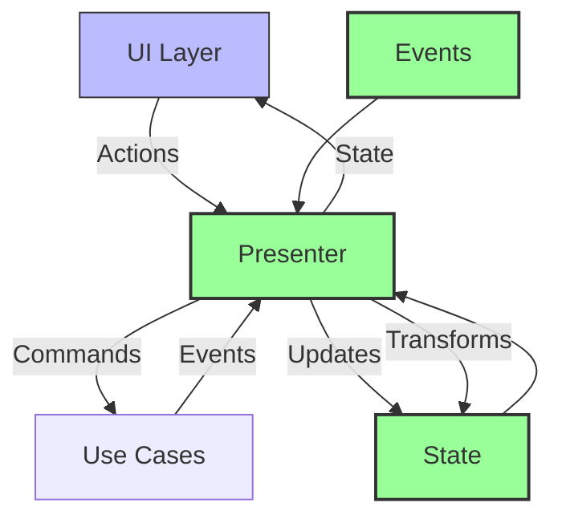

# Presentation Layer Architecture Guide

## Core Philosophy

Our presentation architecture is built on three fundamental principles:

1. **Platform Independence**: The business logic should be completely decoupled from the UI implementation.
2. **Unidirectional Data Flow**: State flows down, actions flow up, making the system predictable and debuggable.
3. **Event-Driven Updates**: Changes propagate through the system via well-defined events.

## Architecture Overview



### Why This Architecture?

1. **Separation of Concerns**
   - UI layer focuses purely on presentation
   - Presenter manages state and business logic
   - Use cases handle domain operations
   - Each layer has a single responsibility

2. **Testability**
   - UI can be tested in isolation
   - Business logic can be tested without UI
   - State transitions are predictable and testable
   - Events can be mocked and verified

3. **Maintainability**
   - Changes to UI don't affect business logic
   - Business logic changes don't require UI updates
   - New features can be added without modifying existing code
   - Clear boundaries between components

### Key Components

1. **Presenter**
   - Acts as the bridge between UI and business logic
   - Manages application state
   - Handles UI actions
   - Transforms domain events into UI state

2. **State**
   - Immutable data structure
   - Represents entire UI state
   - Single source of truth
   - Easy to debug and test

3. **Events**
   - Represent domain changes
   - Flow from bottom to top
   - Can be transformed and combined
   - Enable loose coupling

## Implementation Guide

### 1. Define Your State

Start by defining what your UI needs to display:

```dart
class AppState {
  final bool isLoading;
  final User? currentUser;
  final String? error;
  final bool isAuthenticated;

  const AppState({
    this.isLoading = false,
    this.currentUser,
    this.error,
    this.isAuthenticated = false,
  });

  // IMPORTANT: Always implement copyWith
  AppState copyWith({...}) {...}
  
  // IMPORTANT: Always implement equality
  @override
  bool operator ==(Object other) {...}
  
  @override
  int get hashCode {...}
}
```

### 2. Define Your Presenter Interface

Create a clear contract for UI interaction:

```dart
abstract class AppPresenter {
  // State stream that UI will listen to
  Stream<AppState> get state;

  // Actions that UI can trigger
  Future<void> login(String username, String password);
  Future<void> logout();
  
  // Lifecycle methods
  Future<void> initialize();
  Future<void> dispose();
}
```

### 3. Implement the Presenter

```dart
class AppPresenterImpl implements AppPresenter {
  final _stateController = BehaviorSubject<AppState>.seeded(AppState());
  
  @override
  Stream<AppState> get state => _stateController.stream;

  void _updateState(AppState Function(AppState) update) {
    final newState = update(_stateController.value);
    if (newState != _stateController.value) {
      _stateController.add(newState);
    }
  }
  
  // Handle domain events
  void _handleEvents(DomainEvent event) {
    if (event is UserLoggedIn) {
      _updateState((state) => state.copyWith(
        isAuthenticated: true,
        currentUser: event.user,
        error: null,
      ));
    }
  }
}
```

### 4. Create Your UI

The UI should be a pure function of state:

```dart
class LoginScreen extends StatelessWidget {
  final AppPresenter presenter;

  @override
  Widget build(BuildContext context) {
    return StreamBuilder<AppState>(
      stream: presenter.state,
      builder: (context, snapshot) {
        final state = snapshot.data ?? AppState();
        return _buildUI(state);
      },
    );
  }
}
```

## Best Practices and Patterns

### 1. State Management

✅ **Do**:
- Make state immutable
- Use copyWith for updates
- Implement proper equality
- Keep state minimal

❌ **Don't**:
- Mutate state directly
- Store derived data
- Mix UI and domain state
- Duplicate state

### 2. Event Handling

✅ **Do**:
- Categorize events by type
- Transform events to state
- Handle errors gracefully
- Clean up subscriptions

❌ **Don't**:
- Mix event handling with UI logic
- Ignore error events
- Leak subscriptions
- Handle events synchronously when async is needed

### 3. Error Handling

✅ **Do**:
```dart
try {
  await useCase.execute();
} catch (e) {
  _updateState((state) => state.copyWith(
    error: e.toString(),
    isLoading: false,
  ));
}
```

❌ **Don't**:
```dart
try {
  await useCase.execute();
} catch (e) {
  print(e); // Don't just log errors
  throw e; // Don't rethrow without handling
}
```

## Testing Strategies

### 1. State Testing

```dart
test('login updates state correctly', () {
  final presenter = AppPresenterImpl();
  final states = <AppState>[];
  
  presenter.state.listen(states.add);
  
  await presenter.login('user', 'pass');
  
  expect(states, [
    isA<AppState>().having((s) => s.isLoading, 'loading', true),
    isA<AppState>().having((s) => s.isAuthenticated, 'authenticated', true),
  ]);
});
```

### 2. Event Testing

```dart
test('handles error events correctly', () {
  final presenter = AppPresenterImpl();
  
  when(useCase.execute())
      .thenAnswer((_) => Stream.error('Network error'));
      
  await presenter.login('user', 'pass');
  
  expect(
    presenter.state,
    emits(isA<AppState>().having((s) => s.error, 'error', 'Network error')),
  );
});
```

## Common Pitfalls and Solutions

1. **State Updates Not Reflecting**
   - Ensure proper equality implementation
   - Verify state stream subscription
   - Check for proper state updates

2. **Memory Leaks**
   - Always dispose of controllers
   - Cancel subscriptions
   - Use weak references when needed

3. **Inconsistent State**
   - Use atomic updates
   - Validate state transitions
   - Implement state invariants

## Migration Guide

If you're migrating from a different architecture:

1. **Start with State**
   - Define your state model
   - Make it immutable
   - Add necessary operations

2. **Create Presenter**
   - Define the interface
   - Implement basic operations
   - Add event handling

3. **Update UI**
   - Remove state management
   - Listen to presenter
   - Dispatch actions

4. **Add Testing**
   - Test state transitions
   - Test event handling
   - Test error cases

## Performance Considerations

1. **State Updates**
   - Minimize state updates
   - Use distinct until changed
   - Batch updates when possible

2. **Event Processing**
   - Consider debouncing
   - Use throttling when needed
   - Process events asynchronously

3. **Memory Management**
   - Dispose resources properly
   - Use weak references
   - Monitor memory usage

## Conclusion

This architecture provides:
- Clear separation of concerns
- Predictable state management
- Easy testing
- Maintainable code

Remember:
- Keep state immutable
- Handle events properly
- Test thoroughly
- Clean up resources 