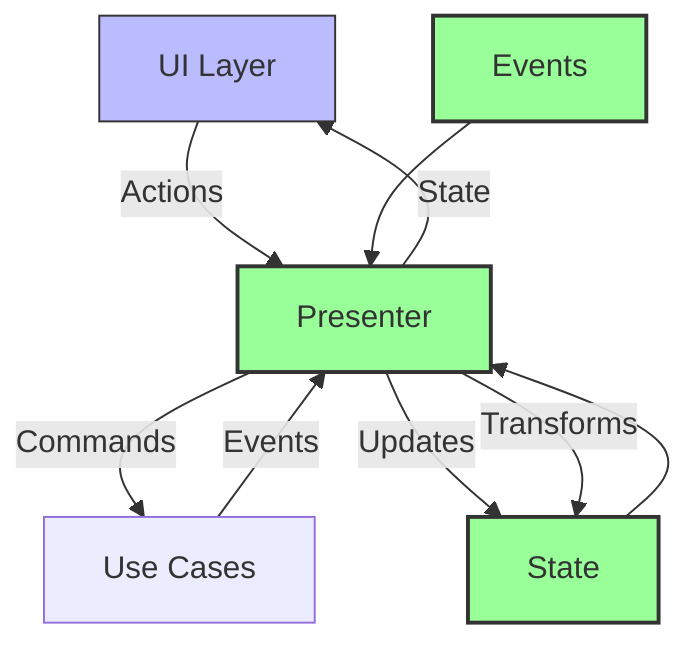
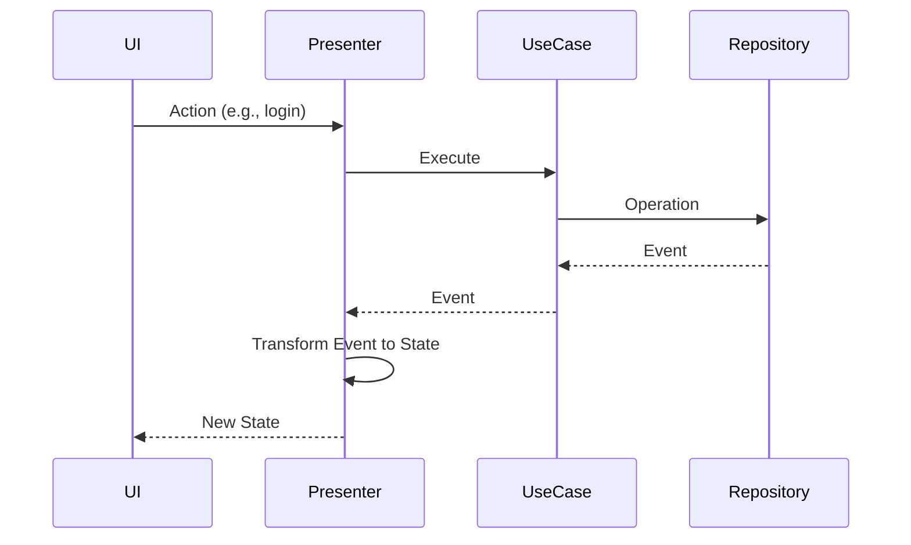

# Presentation Layer Architecture Guide

## Overview

This guide explains the presentation layer architecture implemented in the Ever app, focusing on our approach to state management, event handling, and UI abstraction. The architecture follows a unidirectional data flow pattern while maintaining platform independence.

### Architecture Overview



### UI Interchangeability

One of the key strengths of this architecture is the ability to easily swap UI implementations while maintaining application state and behavior. Since all state management and business logic lives in the presenter layer, UIs are effectively stateless views that:

1. **Observe State**:
```dart
class FlutterLoginScreen extends StatelessWidget {
  @override
  Widget build(BuildContext context) {
    return StreamBuilder<EverState>(
      stream: presenter.state,
      builder: (context, snapshot) {
        final state = snapshot.data ?? EverState.initial();
        return _buildUI(state);
      },
    );
  }
}
```

2. **Dispatch Actions**:
```dart
// Flutter Material UI
ElevatedButton(
  onPressed: () => presenter.login(credentials),
  child: Text('Login'),
)

// CLI UI
void handleCommand(String command) {
  switch (command) {
    case 'login':
      presenter.login(credentials);
      break;
  }
}

// Web UI
<button onClick={() => presenter.login(credentials)}>
  Login
</button>
```

This architecture enables:

1. **Multiple UI Flavors**:
   - Material Design implementation
   - Cupertino (iOS-style) implementation
   - Custom branded UI
   - CLI interface
   - Web interface

2. **Easy A/B Testing**:
   ```dart
   Widget buildLoginUI(EverState state) {
     return experimentGroup == 'A' 
       ? LoginScreenA(state: state)
       : LoginScreenB(state: state);
   }
   ```

3. **Platform-Specific UIs**:
   ```dart
   Widget buildPlatformUI(EverState state) {
     if (Platform.isIOS) {
       return CupertinoLoginScreen(state: state);
     } else if (Platform.isAndroid) {
       return MaterialLoginScreen(state: state);
     } else {
       return WebLoginScreen(state: state);
     }
   }
   ```

4. **Seamless State Preservation**:
   - Switch UI implementations without losing state
   - Maintain authentication across UI changes
   - Preserve user data and preferences
   - Continue operations in progress

Example of switching UI implementations:

```dart
class App extends StatelessWidget {
  final EverPresenter presenter; // Same presenter
  final String uiImplementation; // Can be changed dynamically

  @override
  Widget build(BuildContext context) {
    switch (uiImplementation) {
      case 'material':
        return MaterialApp(
          home: MaterialLoginScreen(presenter: presenter),
        );
      case 'cupertino':
        return CupertinoApp(
          home: CupertinoLoginScreen(presenter: presenter),
        );
      case 'custom':
        return CustomApp(
          home: CustomLoginScreen(presenter: presenter),
        );
      default:
        return MaterialApp(
          home: MaterialLoginScreen(presenter: presenter),
        );
    }
  }
}
```

Benefits of this approach:

1. **Development Efficiency**:
   - Develop and test UI variants independently
   - Reuse core business logic across variants
   - Simplified UI testing (just test state rendering)

2. **User Experience**:
   - Consistent behavior across UI variants
   - Seamless transitions between UIs
   - No state loss during UI switches

3. **Maintenance**:
   - Localize UI changes to view layer
   - Test business logic independently
   - Easy to add new UI variants

4. **Experimentation**:
   - Simple A/B testing implementation
   - Easy to prototype new UI designs
   - Quick iteration on user feedback

## Core Concepts

### 1. Platform-Independent Presenter

The `EverPresenter` interface provides a platform-agnostic way to handle UI logic:

```dart
abstract class EverPresenter {
  /// Stream of the current state
  Stream<EverState> get state;

  /// User Actions
  Future<void> register(String username);
  Future<void> login(String userSecret);
  Future<void> logout();
  
  /// Resource Management
  Future<void> initialize();
  Future<void> dispose();
}
```

Key benefits:
- Platform independence
- Clear interface contract
- Testable behavior
- Separation of concerns

### 2. Immutable State

```dart
class EverState {
  final bool isLoading;
  final User? currentUser;
  final List<Note> notes;
  final List<Task> tasks;
  final String? error;
  final bool isAuthenticated;

  const EverState({
    this.isLoading = false,
    this.currentUser,
    this.notes = const [],
    this.tasks = const [],
    this.error,
    this.isAuthenticated = false,
  });

  /// Factory methods for common states
  factory EverState.initial() => const EverState();
  factory EverState.loading() => const EverState(isLoading: true);
  factory EverState.error(String message) => EverState(error: message);
}
```

Benefits:
- Predictable state transitions
- Easy to test and debug
- Thread-safe
- Efficient equality comparisons

### 3. Event-Driven Updates



## Implementation Patterns

### 1. State Management

```dart
class FlutterEverPresenter implements EverPresenter {
  final _stateController = BehaviorSubject<EverState>.seeded(EverState.initial());
  
  @override
  Stream<EverState> get state => _stateController.stream;

  void _updateState(EverState newState) {
    // Only emit if state actually changed
    if (_stateController.value != newState) {
      _stateController.add(newState);
    }
  }
}
```

Key aspects:
1. Single source of truth
2. Distinct state updates
3. Reactive state stream
4. Efficient updates

### 2. Event Handling

```dart
void _handleUserEvents(DomainEvent event) {
  if (event is CurrentUserRetrieved) {
    _updateState(
      _stateController.value.copyWith(
        isLoading: false,
        currentUser: event.user,
        isAuthenticated: event.user != null,
        error: null,
      ),
    );
  } else if (event is OperationFailure) {
    _updateState(
      _stateController.value.copyWith(
        isLoading: false,
        error: event.error,
      ),
    );
  }
}
```

Key patterns:
1. Event categorization
2. State transformation
3. Error handling
4. Loading state management

### 3. Action Processing

```dart
@override
Future<void> login(String userSecret) async {
  // Clear errors and show loading
  _updateState(EverState.initial().copyWith(isLoading: true));
  
  // Execute use case
  _loginUseCase.execute(LoginParams(userSecret: userSecret));
}
```

Best practices:
1. Clear error state
2. Show loading indicator
3. Preserve relevant state
4. Handle failures gracefully

## Testing Strategies

### 1. State Testing

```dart
test('updates state during login flow', () async {
  final user = User(id: '1', username: 'test');
  
  await presenter.login('secret123');
  await pumpEventQueue();
  loginEventController.add(OperationInProgress('login'));
  await pumpEventQueue();
  getCurrentUserEventController.add(CurrentUserRetrieved(user));
  await pumpEventQueue();

  expect(states, [
    isEverState(),
    isEverState(isLoading: true),
    isEverState(
      isLoading: false,
      currentUser: user,
      isAuthenticated: true,
    ),
  ]);
});
```

Key aspects:
1. State sequence verification
2. Event-state correlation
3. Async state changes
4. Edge case coverage

### 2. Event Testing

```dart
test('handles login failure', () async {
  await presenter.login('secret123');
  await pumpEventQueue();
  loginEventController.add(OperationInProgress('login'));
  await pumpEventQueue();
  loginEventController.add(OperationFailure('login', 'Invalid credentials'));
  await pumpEventQueue();

  expect(states, [
    isEverState(),
    isEverState(isLoading: true),
    isEverState(error: 'Invalid credentials'),
  ]);
});
```

Focus areas:
1. Error handling
2. Event transformation
3. State consistency
4. Loading states

### 3. Resource Management

```dart
test('cleans up resources on dispose', () async {
  await presenter.dispose();
  expect(presenter.state, emitsDone);
});
```

Key points:
1. Subscription cleanup
2. Stream closure
3. Resource release
4. Memory leak prevention

## Best Practices

### 1. State Updates

1. **Atomic Updates**:
   ```dart
   // Good
   _updateState(_stateController.value.copyWith(
     isLoading: true,
     error: null,
   ));

   // Bad - Multiple updates
   _updateState(_stateController.value.copyWith(isLoading: true));
   _updateState(_stateController.value.copyWith(error: null));
   ```

2. **Preserve State**:
   ```dart
   // Good - Preserve user during loading
   _updateState(_stateController.value.copyWith(isLoading: true));

   // Bad - Lose user state
   _updateState(EverState.initial().copyWith(isLoading: true));
   ```

3. **Clear Errors**:
   ```dart
   // Good - Clear errors on new operation
   _updateState(_stateController.value.copyWith(
     isLoading: true,
     error: null,
   ));

   // Bad - Leave stale errors
   _updateState(_stateController.value.copyWith(
     isLoading: true,
   ));
   ```

### 2. Event Handling

1. **Event Categorization**:
   ```dart
   // Good
   void _handleUserEvents(DomainEvent event) {
     if (event is CurrentUserRetrieved) {
       // Handle user retrieval
     } else if (event is OperationFailure) {
       // Handle failure
     }
   }

   // Bad
   void _handleAllEvents(dynamic event) {
     // Handle everything in one place
   }
   ```

2. **Event Transformation**:
   ```dart
   // Good
   if (event is TokenObtained) {
     getCurrentUser(); // Transform to user state
   }

   // Bad
   if (event is TokenObtained) {
     _updateState(...); // Direct state update
   }
   ```

3. **Error Propagation**:
   ```dart
   // Good
   if (event is OperationFailure) {
     _updateState(_stateController.value.copyWith(
       error: event.error,
       isLoading: false,
     ));
   }

   // Bad
   if (event is OperationFailure) {
     throw Exception(event.error);
   }
   ```

## Future Improvements

1. **State Management**:
   - State history tracking
   - Undo/redo support
   - State persistence
   - State restoration

2. **Event Handling**:
   - Event debouncing
   - Event throttling
   - Event correlation
   - Event logging

3. **Testing**:
   - State snapshot testing
   - Event sequence testing
   - Performance testing
   - State transition testing

4. **Monitoring**:
   - State transition metrics
   - Event processing metrics
   - Error tracking
   - Performance monitoring 