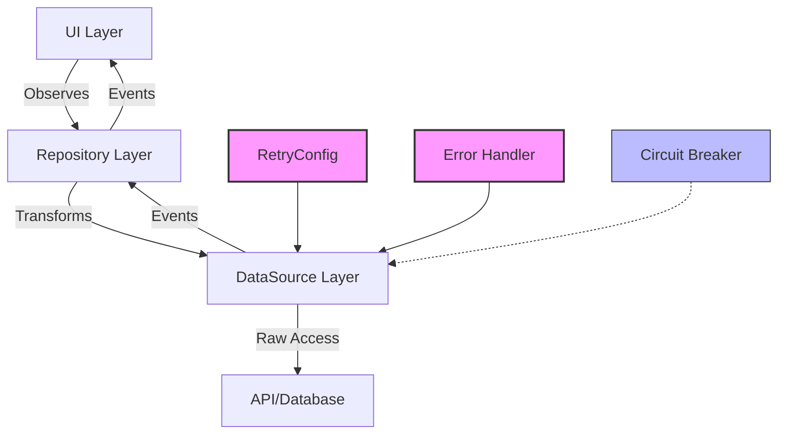
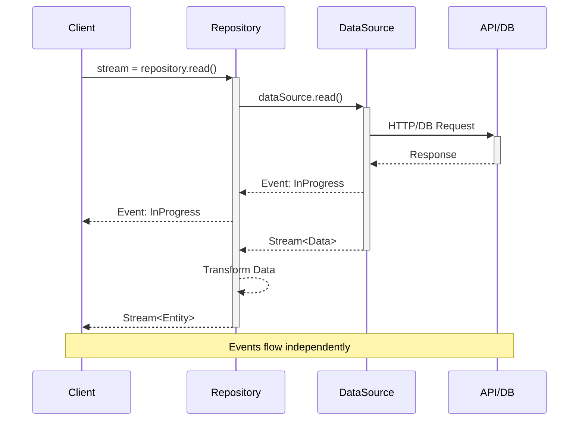
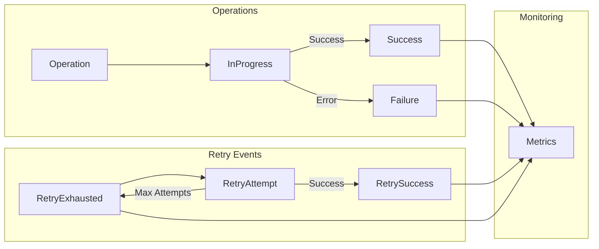
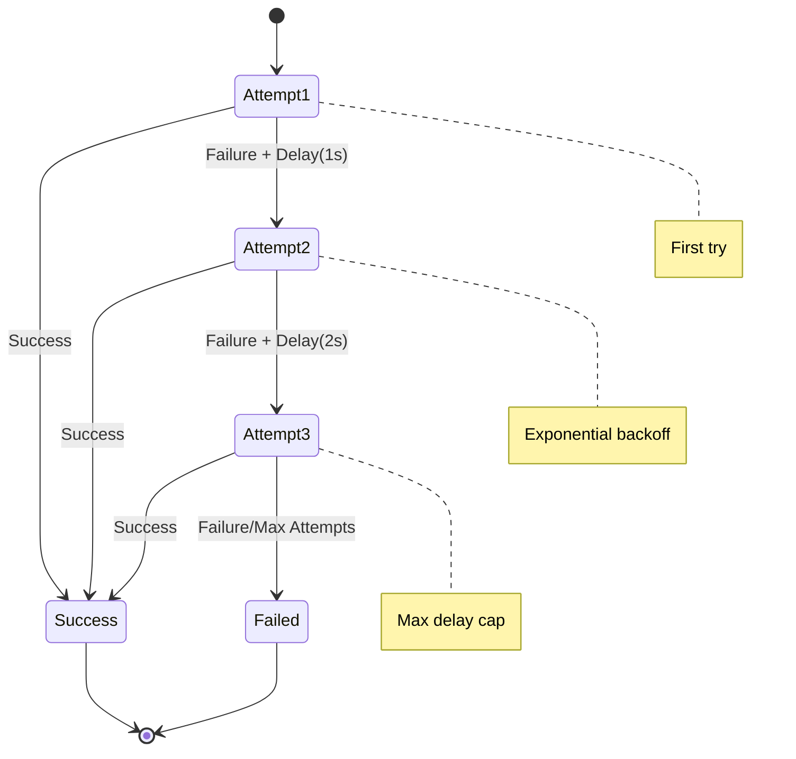
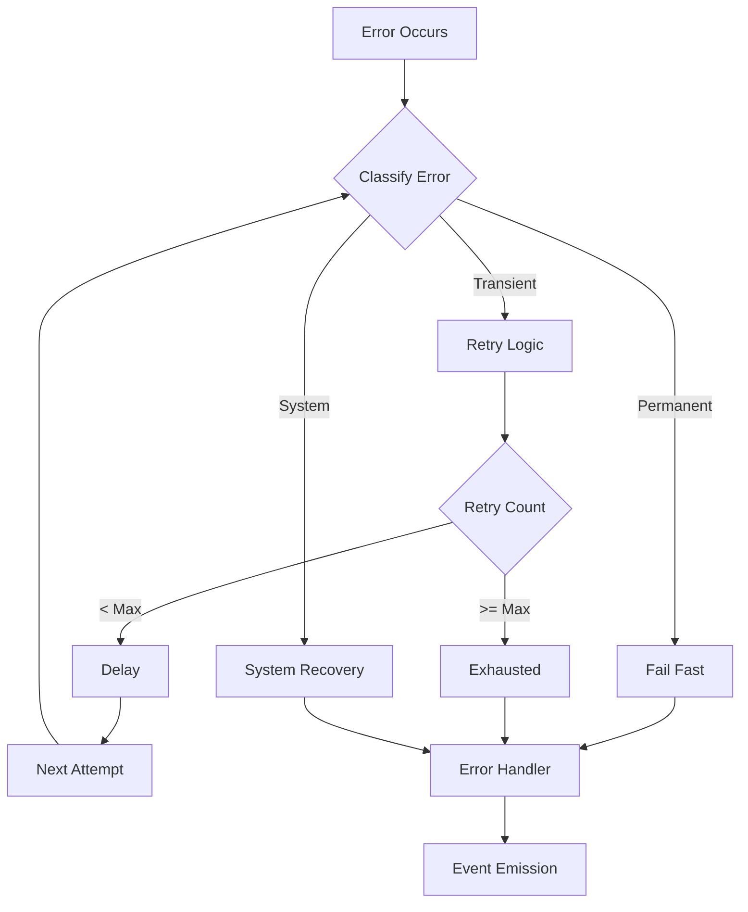

# Reactive Architecture Guide

## Overview

This guide explains the reactive architecture implemented in the Ever app, including our approach to data handling, error recovery, and resilience patterns. The architecture follows reactive programming principles while incorporating enterprise-grade reliability patterns.

### Architecture Overview



## Core Concepts

### 1. Reactive Streams

Our architecture is built around reactive streams, providing:
- Non-blocking operations
- Push-based data flow
- Backpressure handling
- Error propagation
- Resource cleanup



### 2. Event-Driven Architecture



## Layered Architecture

### 1. Data Sources

The lowest layer, responsible for:
- Raw data access (API, database)
- Error handling and recovery
- Event emission
- Resource management

```dart
abstract class BaseDataSource<T> {
  Stream<DomainEvent> get events;
  Future<void> initialize();
  void dispose();
  // CRUD operations
}
```

### 2. Repositories

Middle layer that:
- Transforms data between domain and data layers
- Manages caching strategies
- Handles complex operations
- Provides domain-specific operations

```dart
class UserRepositoryImpl implements UserRepository {
  final UserDataSource _dataSource;
  final _eventController = StreamController<DomainEvent>.broadcast();
  
  Stream<DomainEvent> get events => _eventController.stream;
  // Implementation
}
```

## Resilience Patterns

### 1. Retry with Exponential Backoff



### 2. Error Recovery Flow



## Best Practices

### 1. Error Handling

1. **Classify Errors**:
   - Transient (network issues, timeouts)
   - Permanent (validation errors, not found)
   - System errors (configuration, initialization)

2. **Error Recovery**:
   - Retry transient errors
   - Fail fast on permanent errors
   - Proper error transformation between layers

### 2. Resource Management

1. **Initialization**:
   ```dart
   Future<void> initialize() async {
     // Setup resources
     // Load cached data
     // Initialize connections
   }
   ```

2. **Cleanup**:
   ```dart
   void dispose() {
     _eventController.close();
     // Release other resources
   }
   ```

### 3. Testing

1. **Unit Tests**:
   - Test retry logic
   - Verify event emission
   - Check error handling

2. **Integration Tests**:
   - End-to-end flows
   - Error scenarios
   - Recovery behavior

## References

1. Reactive Programming:
   - [ReactiveX](http://reactivex.io/)
   - [Reactive Streams](https://www.reactive-streams.org/)
   - [Reactive Manifesto](https://www.reactivemanifesto.org/)

2. Resilience Patterns:
   - [Martin Fowler - Circuit Breaker](https://martinfowler.com/bliki/CircuitBreaker.html)
   - [Microsoft - Retry Pattern](https://docs.microsoft.com/en-us/azure/architecture/patterns/retry)
   - [Implementing Retry Pattern in Dart](https://medium.com/flutter-community/implementing-retry-pattern-in-dart-flutter-84af66cdb56f)

3. Event-Driven Architecture:
   - [Martin Fowler - Event Sourcing](https://martinfowler.com/eaaDev/EventSourcing.html)
   - [CQRS Pattern](https://docs.microsoft.com/en-us/azure/architecture/patterns/cqrs)

## Implementation Examples

### Complete Retry Implementation

```dart
/// Configuration
class RetryConfig {
  final int maxAttempts;
  final Duration initialDelay;
  final Duration maxDelay;
  final double backoffFactor;

  const RetryConfig({
    required this.maxAttempts,
    required this.initialDelay,
    required this.maxDelay,
    required this.backoffFactor,
  });

  Duration getDelayForAttempt(int attempt) {
    if (attempt <= 0) return Duration.zero;
    final exponentialDelay = initialDelay * (backoffFactor * (attempt - 1));
    return exponentialDelay > maxDelay ? maxDelay : exponentialDelay;
  }
}

/// Usage in DataSource
class UserDataSourceImpl implements UserDataSource {
  final RetryConfig _retryConfig;
  
  Future<T> _executeWithRetry<T>(
    String operation,
    Future<T> Function() apiCall,
  ) async {
    int attempts = 0;
    while (true) {
      try {
        attempts++;
        return await apiCall();
      } catch (error) {
        if (!_shouldRetry(error) || attempts >= _retryConfig.maxAttempts) {
          rethrow;
        }
        final delay = _retryConfig.getDelayForAttempt(attempts);
        await Future.delayed(delay);
      }
    }
  }
}
```

### Event Handling Example

```dart
class UserRepositoryImpl implements UserRepository {
  final _eventController = StreamController<DomainEvent>.broadcast();
  
  Stream<User> register(String username) async* {
    _eventController.add(OperationInProgress('register'));
    try {
      final user = await _dataSource.register(username).first;
      _eventController.add(OperationSuccess('register', user));
      yield user;
    } catch (e) {
      _eventController.add(OperationFailure('register', e));
      rethrow;
    }
  }
}
```

## Monitoring & Observability

The architecture provides rich telemetry through events:

1. **Operation Metrics**:
   - Success/failure rates
   - Retry attempts
   - Operation durations
   - Error distributions

2. **Health Monitoring**:
   - Resource usage
   - Connection states
   - Cache hit rates
   - Error patterns

3. **Debugging**:
   - Operation traces
   - Error contexts
   - State transitions
   - Recovery attempts

## Future Improvements

1. **Circuit Breaker Pattern**:
   - Prevent cascade failures
   - Automatic service degradation
   - Self-healing capabilities

2. **Caching Strategies**:
   - Improved cache invalidation
   - Cache warming
   - Partial updates

3. **Metrics Collection**:
   - Centralized monitoring
   - Performance analytics
   - Error trending 