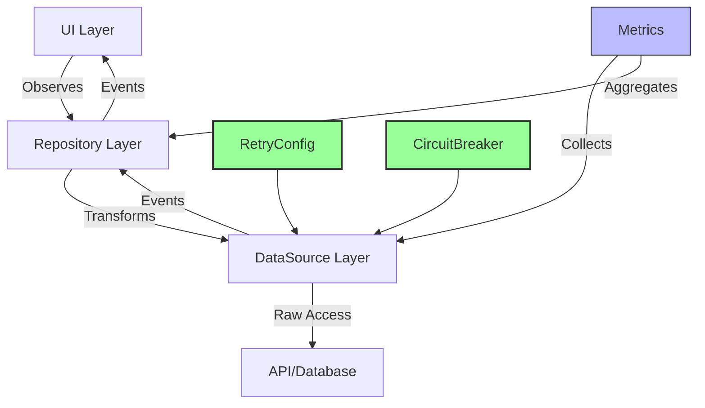
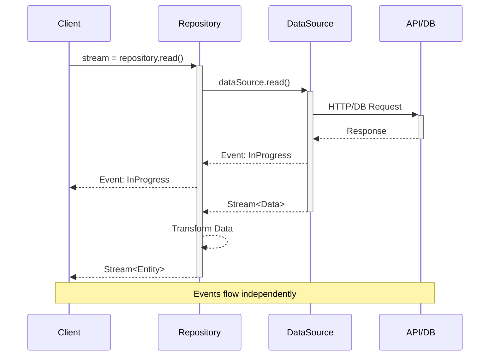
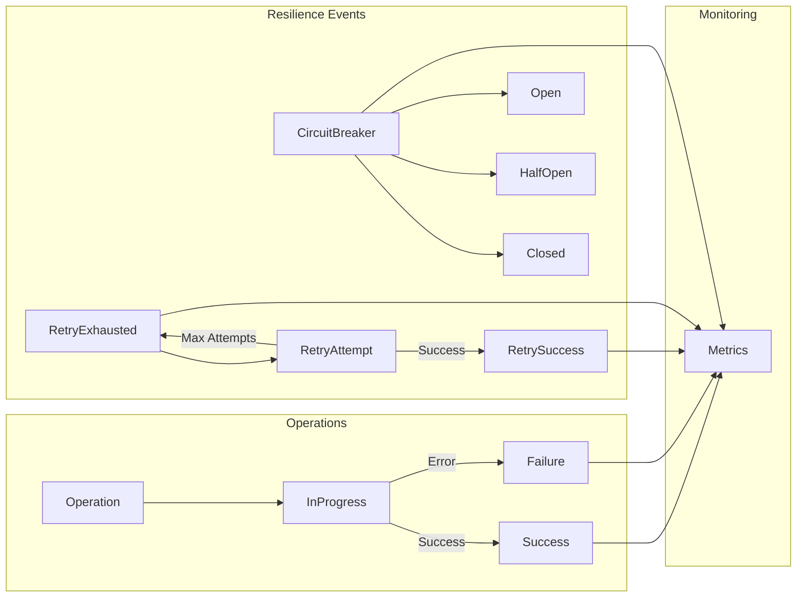
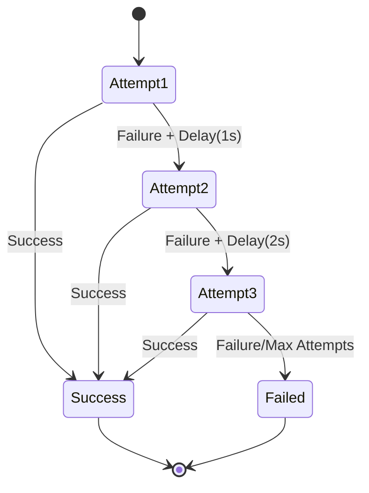
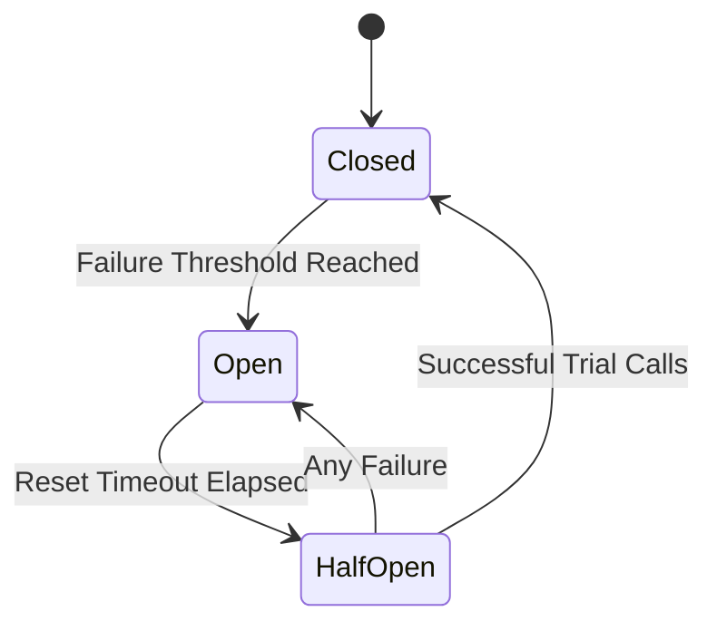

# Reactive Architecture Guide

## Overview

This guide explains the reactive architecture implemented in the Ever app, including our approach to data handling, error recovery, and resilience patterns. The architecture follows reactive programming principles while incorporating enterprise-grade reliability patterns.

### Architecture Overview



## Core Concepts

### 1. Reactive Streams

Our architecture is built around reactive streams, providing:
- Non-blocking operations
- Push-based data flow
- Backpressure handling
- Error propagation
- Resource cleanup



### 2. Event-Driven Architecture



## Resilience Patterns

### 1. Retry with Exponential Backoff

The retry mechanism provides automatic retry of failed operations with exponential backoff:



#### Configuration

```dart
class RetryConfig {
  final int maxAttempts;        // Maximum retry attempts
  final Duration initialDelay;   // Initial delay before first retry
  final Duration maxDelay;       // Maximum delay between retries
  final double backoffFactor;    // Multiplier for each subsequent retry
}
```

Default configuration:
- `maxAttempts`: 3
- `initialDelay`: 1 second
- `maxDelay`: 10 seconds
- `backoffFactor`: 2.0

#### Events

The retry mechanism emits the following events:
- `RetryAttempt`: When a retry is about to be attempted
- `RetrySuccess`: When an operation succeeds after retries
- `RetryExhausted`: When all retry attempts are exhausted

### 2. Circuit Breaker Pattern

The circuit breaker prevents cascade failures and provides automatic service degradation:



#### States

1. **Closed** (Normal Operation):
   - All calls proceed normally
   - Failures are counted
   - Transitions to Open if failure threshold is reached

2. **Open** (Service Degraded):
   - All calls are rejected immediately
   - Automatic transition to Half-Open after reset timeout
   - Prevents cascade failures

3. **Half-Open** (Recovery Mode):
   - Limited number of trial calls allowed
   - Success transitions to Closed after max attempts
   - Any failure transitions back to Open
   - Prevents premature recovery

#### Configuration

```dart
class CircuitBreakerConfig {
  final int failureThreshold;     // Failures before opening
  final Duration resetTimeout;     // Time before recovery attempt
  final int halfOpenMaxAttempts;  // Trial calls allowed
}
```

Default configuration:
- `failureThreshold`: 5
- `resetTimeout`: 30 seconds
- `halfOpenMaxAttempts`: 3

#### Events

The circuit breaker emits the following events:
- `transition_to_open`: Service is degraded
- `transition_to_half_open`: Recovery is being attempted
- `transition_to_closed`: Service is restored
- `operation_rejected`: Call was rejected

## Implementation Examples

### 1. Using Retry Mechanism

```dart
// Configure retry behavior
final retryConfig = RetryConfig(
  maxAttempts: 3,
  initialDelay: Duration(seconds: 1),
  maxDelay: Duration(seconds: 10),
  backoffFactor: 2.0,
);

// Execute with retry
Stream<T> _executeWithRetry<T>(
  String operation,
  Future<T> Function() apiCall,
) async* {
  int attempts = 0;
  while (attempts < retryConfig.maxAttempts) {
    try {
      attempts++;
      final result = await apiCall();
      yield result;
      return;
    } catch (error) {
      if (!_isRetryable(error) || 
          attempts >= retryConfig.maxAttempts) {
        rethrow;
      }
      final delay = retryConfig.getDelayForAttempt(attempts);
      await Future.delayed(delay);
    }
  }
}
```

### 2. Using Circuit Breaker

```dart
// Configure circuit breaker
final circuitBreaker = CircuitBreaker(
  CircuitBreakerConfig(
    failureThreshold: 5,
    resetTimeout: Duration(seconds: 30),
    halfOpenMaxAttempts: 3,
  )
);

// Execute through circuit breaker
Future<T> execute<T>(Future<T> Function() operation) async {
  // Circuit breaker will:
  // 1. Track failures in closed state
  // 2. Reject calls in open state
  // 3. Allow limited calls in half-open state
  // 4. Handle state transitions automatically
  return await circuitBreaker.execute(operation);
}
```

## Best Practices

### 1. Retry Configuration

1. **Identify Retryable Operations**:
   - Network timeouts
   - Rate limiting responses
   - Temporary service unavailability
   - Connection errors

2. **Configure Appropriate Delays**:
   - Start with small initial delays (1s)
   - Use reasonable backoff factors (2.0)
   - Cap maximum delays (10s)
   - Consider operation context

3. **Set Reasonable Attempt Limits**:
   - 3-5 attempts typically sufficient
   - Consider operation criticality
   - Account for total time impact

### 2. Circuit Breaker Configuration

1. **Failure Thresholds**:
   - Set based on traffic patterns
   - Consider error impact
   - Account for normal error rates
   - Start conservative (5-10)

2. **Reset Timeouts**:
   - Match service recovery patterns
   - Consider dependencies
   - Start with 30-60 seconds
   - Adjust based on monitoring

3. **Half-Open Attempts**:
   - Limited trial calls (2-3)
   - Prevent premature recovery
   - Consider service capacity
   - Monitor success rates

### 3. Monitoring

1. **Key Metrics**:
   - Retry attempts/success rates
   - Circuit breaker state changes
   - Operation latencies
   - Error distributions

2. **Alerts**:
   - Service degradation
   - High retry rates
   - Circuit breaker trips
   - Recovery failures

3. **Dashboards**:
   - Real-time state visualization
   - Historical patterns
   - Error trending
   - Performance impact

## Future Improvements

1. **Enhanced Monitoring**:
   - Centralized metrics collection
   - Real-time dashboards
   - Automated alerting
   - Pattern analysis

2. **Advanced Patterns**:
   - Bulkhead isolation
   - Rate limiting
   - Request caching
   - Load shedding

3. **Configuration Management**:
   - Dynamic thresholds
   - Pattern recognition
   - Automated tuning
   - A/B testing support 